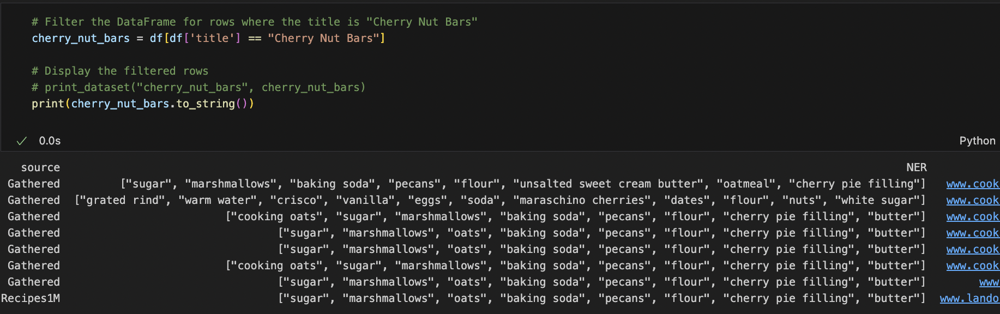
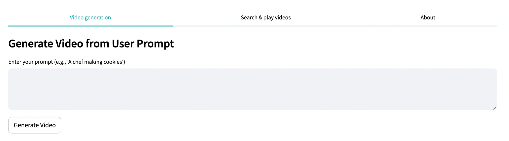
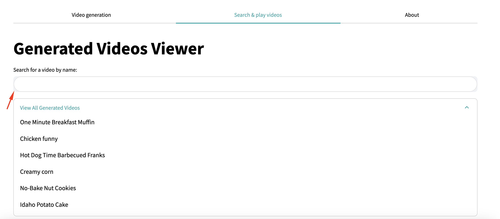

# Text-to-Video Generation

This project was developed as part of the academic program at the University of Prishtina “Hasan Prishtina,” within the Faculty of Electrical and Computer Engineering for the course Natural Language Processing, under the guidance of Mërgim Hoti.

The objective of this project is to develop a model that can interpret natural language descriptions and generate corresponding short video clips. The project aims to bridge the gap between text-based generation and multimedia generation by advancing beyond static content creation. To achieve this goal, a dataset showcasing the wonders of food composition was utilized. This dataset includes a wide variety of dishes, ranging from simple bread recipes to elaborate Swedish midsummer smorgasbords. It is available on the **[Recipe Dataset (over 2M) Food](https://www.kaggle.com/datasets/wilmerarltstrmberg/recipe-dataset-over-2m)** through the Kaggle platform.

## Dataset details

The dataset used in this project contains recipes from around the world, ranging from simple dishes like bread to complex meals like a Swedish midsummer smorgasbord. This dataset is available on the Kaggle platform and can be accessed through the following link:

**[Recipe Dataset (over 2M) Food](https://www.kaggle.com/datasets/wilmerarltstrmberg/recipe-dataset-over-2m)**

Key features of the dataset:
- **Dataset columns:** The dataset contains the following columns:
    - title: The title of the recipe.
    - ingredients: A list of ingredients and their amounts (unorganized format).
    - directions: Instructions for preparing the dish (unorganized format).
    - link: A URL linking to the original recipe source.
    - source: The source of the recipe (e.g., “Gathered” or “Recipes1M”).
    - NER: Organized ingredients without quantities, brands, or extra details.
    - site: The domain from which the recipe was gathered.
- **Number of rows and unique values:** 
    - Total rows: 2.23 million.
    - Unique values in key columns:
        - title: 1,312,871 unique values.
	    - ingredients: 2,226,362 unique values.
	    - directions: 2,211,644 unique values.
	    - NER: 200,476 unique values.
- **Dataset size:** The dataset has a size of approximately 2.31 GB.
- **Attribute types:**
    1. Categorical (Qualitative)
        - Nominale: 'title', 'ingredients', 'directions', 'link', 'source', 'NER', 'site'
    2. Textual
        - Columns such as ingredients and directions contain long textual data, which can be further analyzed or structured as needed.
- **Special Features:**
    - Some columns, like ingredients and NER, contain data in array format. To work with these arrays, you can use the df.apply() method and the json module.
    - Duplicate values have been removed in the NER column, and all values have been standardized to lowercase for consistency.
- **Source:** The dataset has been compiled from various online sources and published on Kaggle for use in machine learning projects and other applications.

## Project Structure
This project is developed in several phases, organized as follows:
- `data_preparation/main.ipynb`: SPython script that performs dataset processing and preparation.
- `ner_analysis/ner_analysis.ipynb`: Python script that executes the analysis of NLP steps, including:
Segmentation, Tokenization, Stop Words, Stemming, Lemmatization, POS Tagging, Feature Extraction, NER.
- `train_test/train_test.ipynb`: Python script that trains and tests the model on the prepared dataset.
- `files/`: Directory where the datasets used in the project are stored.
- `images/`: Directory for storing images created or used during the project.
- `requirements.txt`: List of libraries and dependencies required for running the project.
- `README.md`: Main documentation containing basic information and usage instructions for the project.

## Visualization techniques
- Boxplots for outliers and noise analysis.
- Pie Charts to show gender distribution across seasons.
- Bar charts to show total purchase amounts by category.

## Some of our results in data preprocessing
### 1. *Data Quality*:
#### 1.1 *Management of *null** values:
- Several different types of columns with *null* values ​​were found in our dataset.


- We ignored the *null* values ​​of other columns due to the small number of null values.

#### 1.2 *Duplicate Management*:
- Some duplicates were not found in our dataset:


- But we checked if we have duplicate values in title column:


- After we found that we have duplicate recieps we decided to remove nearly duplicate values


- An example that we can show is that cake: Cherry Nut Bars is showed multiple times and dataset looked like this before:



- After we have removed nearly duplicates we can see this result:


#### 1.3 *Management of *NaN** values:
- We have some NaN values in our dataset, and we removed them.


#### 1.3 *Management of special characters:
- While train/test dataset we have got errors for special characters we decided to remoove them:


### Clustering Recipe Titles by Category
Our goal here is to efficiently categorize recipes and visualize clusters for analysis.  
We have clustered recipe titles into three categories (Dessert, Dinner, Breakfast) using **K-Means clustering** with **TF-IDF vectorization** for text analysis.  

- **PCA** reduces dimensionality for visualization.  
- Missing values are handled by filling with empty strings.  
- 50% of the data is sampled to improve efficiency.  
- Results are visualized in a scatter plot, showing recipe groupings by category.  


### Noisy Data

Goal is to identify and clean noisy data in the ingredients and directions columns of a recipe dataset. Noisy data includes unnecessary characters, escape symbols, and artifacts from scraping or imports.
- What is Noisy Data?
    1. Unnecessary characters – \", \\, [, ]
	2. Escape characters – \" instead of "
	3. Extra symbols – Leftover from data imports

Reason of removing noisy data is to help us on diagnose issues and prepares for data cleaning.
- Cleaning Noisy Data


- Benefits of Cleaning:
	1. Improved Data Quality – Clean and ready for analysis.
	2. Better Visualization – Clear and readable data.
	3. Accurate Models – No interference from noisy data.

### Outliers

The goal is to identify and handle outliers in the recipe dataset, specifically in the title column. Outliers in this context are rare or unique recipe titles that appear only once in the dataset. These entries may differ significantly from the majority and can affect clustering or machine learning models.

- Why we remove or analyze Outliers?
    1. Remove Outliers – If the goal is to cluster common recipes only.
	2. Separate for Analysis – Outliers can provide insights into unique or special recipes.
	3. Label as ‘Rare’ – Useful for labeling and segmenting data without deleting them.


- Benefits of handling Outliers:
	1.	Improved Model Accuracy – Clustering and classification models perform better.
	2.	Clearer Grouping – More consistent recipe categories.
	3.	Focused Analysis – Analyze rare recipes separately for special insights.

### Confusion Matrix for Recipe Classification
The goal is to classify recipes into categories (Dessert, Main, Side, Other) based on their ingredients using a confusion matrix to evaluate model performance.  

- Recipes are classified into four categories: **Dessert, Main, Side, Other**.  
- The model applies ingredient-based rules for initial categorization.  
- Simulated predictions are used to generate the confusion matrix.  
- **Confusion Matrix** helps visualize misclassifications and assess model performance.  
- Results are displayed with a heatmap for easy interpretation.  


Benefits of Confusion Matrix:
- Visual Feedback – Highlights correct and incorrect classifications.
- Model Improvement – Pinpoints areas where the model struggles.
- Balanced Evaluation – Shows performance across all categories, not just accuracy.

### Dataset Accuracy

The goal is to evaluate and ensure the accuracy of recipe classification by dynamically categorizing recipes based on their ingredients. Accuracy measures how well the predicted categories align with the true labels, providing insight into the effectiveness of the classification model.

- Why Calculate Dataset Accuracy?  
1. **Model Evaluation** – Determines how well the classification model performs.  
2. **Error Detection** – Highlights misclassified recipes, allowing for further refinement.  
3. **Performance Benchmark** – Helps track improvements across different models and iterations.  


Benefits of handling Outliers:
- Improved Model Accuracy – Clustering and classification models perform better.
- Clearer Grouping – More consistent recipe categories.
- Focused Analysis – Analyze rare recipes separately for special insights.

How Accuracy is Measured  
- The model categorizes recipes into predefined groups: `Dessert`, `Main`, `Side`, and `Other`.  
- Predicted labels are compared with true labels using `accuracy_score` from `sklearn`.  
- Accuracy is expressed as a percentage of correctly classified recipes.  

Benefits of Accuracy Calculation:  
1. **Improved Model Performance** – Enables iterative improvement of classification models.  
2. **Reliable Predictions** – Ensures confidence in the output of automated recipe categorization.  
3. **Quality Assurance** – Reduces errors and enhances the dataset's overall integrity.  

  

## Video generation
This document outlines the process of generating video content from textual recipe data using Stable Diffusion for frame generation. The pipeline consists of two key steps:

1. User Input through Streamlit App – Users provide recipe details through a web interface.
2.	Frame Generation and Video Assembly – Recipe ingredients and instructions are processed to generate corresponding image frames, which are later compiled into videos.

### Technologies used:
- Stable Diffusion (diffusers) – Text-to-image generation
- Pandas – Data handling and transformation
- Scikit-Learn – Data splitting for train/test sets
- Streamlit – User interface for prompt input (optional)
- OS – File and directory management

### Train/Test Data split:
```python
train_df, test_df = train_test_split(df, test_size=0.2, random_state=42)
```
- The dataset is split into 80% training and 20% testing data.
- random_state=42 ensures reproducibility.

### Frames output example:
```python
generated_frames/
├── train/
│   ├── Chocolate_Cake/
│   │   ├── ingredient_1.png
│   │   ├── direction_1.png
│   │   ├── direction_2.png
│   └── ...
│
└── test/
    ├── Lemon_Pie/
    │   ├── ingredient_1.png
    │   ├── direction_1.png
    └── ...
```

### Key points:
- Efficiency: The model generates frames in parallel for ingredients and directions.
- Scalability: The pipeline supports large datasets by iterating over the DataFrame.
- Customization: Modify the prompts for finer control over the style of generated images.

## NLP Pipeline for Recipe Dataset Analysis

This project applies Natural Language Processing (NLP) techniques to analyze and extract key information from a recipe dataset. The goal is to process raw text data, identify important entities such as ingredients and instructions, and prepare the dataset for further analysis or visualization.  In the context of recipe datasets, the objective is to extract essential entities like ingredients, tools, quantities, and actions. The NER step (step 7) is crucial for identifying these entities, which helps:
- Recognize ingredients (e.g., “sugar”, “pineapple”).
- Identify measurements (e.g., “2 cups”, “1 tsp”).
- Extract cooking tools (e.g., “pan”, “oven”).
- Classify actions (e.g., “stir”, “boil”).

How Each Step Contributes to NER:
- Segmentation: Breaks down recipe instructions into smaller steps, ensuring each action or ingredient is processed individually.
- Tokenization: Splits instructions into tokens for finer-grained analysis.
- Stop Words Removal: Eliminates unnecessary words, focusing on essential parts like ingredients or verbs.
- Stemming/Lemmatization: Reduces word variations, ensuring consistency (e.g., “chopped”, “chopping” → “chop”).
- POS Tagging: Helps identify verbs (actions) and nouns (ingredients/tools).
- NER (Final Step): Extracts entities directly from the processed text using custom models or ingredient lists.

#### 1. *Segmentation*:
Segmentation is the process of dividing large blocks of text into smaller, meaningful units, typically sentences or paragraphs. In the context of Natural Language Processing (NLP) for recipe analysis, segmentation is crucial for breaking down unstructured recipe text into distinct steps or instructions. This step ensures that the model can process each part of the recipe independently, leading to more accurate analysis and entity extraction.

- How Segmentation works:

During segmentation, the text is analyzed for specific punctuation marks (such as periods, exclamation points, and question marks) or structural patterns that indicate the end of one segment and the beginning of another. For recipes, segmentation often involves separating:
- Ingredient Lists – Divided by commas or line breaks.
- Cooking Steps – Split by periods or sequential markers like “Step 1, Step 2”.
- Titles/Descriptions – Recognized by headings or bolded text.

In a recipe dataset, segmentation is applied to the directions column, where cooking instructions are often stored as a long string. This process divides the instructions into a list format for easier processing.

- An example of directions before segmentation:
```python
title,directions
No-Bake Nut Cookies,["In a heavy 2-quart saucepan, mix brown sugar, nuts, evaporated milk and butter or margarine.", "Stir over medium heat until mixture bubbles all over top.", "Boil and stir 5 minutes more. Take off heat.", "Stir in vanilla and cereal; mix well.", "Using 2 teaspoons, drop and shape into 30 clusters on wax paper.", "Let stand until firm, about 30 minutes."]
```
- After segmentation:

```python
title,direction_segment
Famous Meatballs,Pour pineapple chunks with juice into a saucepan
Famous Meatballs,"Stir green bell pepper, brown sugar, cornstarch, soy sauce, and lemon juice through the pineapple chunks until sugar and cornstarch dissolve."
Famous Meatballs,"Bring the mixture to a boil; cook and stir until thickened, about 10 minutes."
Famous Meatballs,Place meatballs into slow cooker crock; pour pineapple mixture over meatballs.
Famous Meatballs,"Cook on Medium for 2 hours, stirring every 30 minutes."
```

Benefits of Segmentation in Recipe Analysis:
- Structured Data – Transforms unstructured text into organized lists, enhancing the quality of the dataset.
- Foundation for NLP Pipelines – Acts as the first step for more advanced NLP tasks like tokenization, stop word removal, and NER.
- Facilitates Visualization – Essential for generating images or animations that visually represent each cooking step.

#### 2. *Tokenization*:
Tokenization is the process of breaking down text into smaller units called tokens. In the context of a recipe dataset, tokenization typically involves splitting segmented cooking instructions into individual words or phrases. This step is crucial for preparing text data for further natural language processing (NLP) tasks.

- An example how data look likes after tokenization:

```python
title,direction_segment,tokens
Famous Meatballs,Pour pineapple chunks with juice into a saucepan,"['Pour', 'pineapple', 'chunks', 'with', 'juice', 'into', 'a', 'saucepan']"
Famous Meatballs,"Stir green bell pepper, brown sugar, cornstarch, soy sauce, and lemon juice through the pineapple chunks until sugar and cornstarch dissolve.","['Stir', 'green', 'bell', 'pepper', ',', 'brown', 'sugar', ',', 'cornstarch', ',', 'soy', 'sauce', ',', 'and', 'lemon', 'juice', 'through', 'the', 'pineapple', 'chunks', 'until', 'sugar', 'and', 'cornstarch', 'dissolve', '.']"
Famous Meatballs,"Bring the mixture to a boil; cook and stir until thickened, about 10 minutes.","['Bring', 'the', 'mixture', 'to', 'a', 'boil', ';', 'cook', 'and', 'stir', 'until', 'thickened', ',', 'about', '10', 'minutes', '.']"
Famous Meatballs,Place meatballs into slow cooker crock; pour pineapple mixture over meatballs.,"['Place', 'meatballs', 'into', 'slow', 'cooker', 'crock', ';', 'pour', 'pineapple', 'mixture', 'over', 'meatballs', '.']"
Famous Meatballs,"Cook on Medium for 2 hours, stirring every 30 minutes.","['Cook', 'on', 'Medium', 'for', '2', 'hours', ',', 'stirring', 'every', '30', 'minutes', '.']"
```

Benefits of Tokenization in Recipe Analysis:
- Improved Accuracy for NLP Models – Tokenization allows models to analyze text more effectively by isolating meaningful words.
- Search and Matching – Tokenized recipes enable keyword searches and ingredient matching across datasets.
- Scalable Text Processing – Tokenization simplifies large-scale text data analysis, making datasets more structured and easier to manipulate.
- Facilitates Stop Word Removal – After tokenization, irrelevant or common words can easily be removed to focus on essential recipe components.

#### 3. *Stop Words Removal*:
Stop word removal is the process of filtering out common, less meaningful words (such as “the”, “and”, “of”, etc.) from the tokenized text. In recipe datasets, stop words do not contribute much to the meaning of the instructions but can add noise to the analysis.By removing stop words, the focus shifts to the essential keywords such as ingredients, actions, and measurements, which improves the performance of NLP models.

Why Stop Word Removal is Important:
- Reduces Noise – Eliminates non-essential words that do not add value to recipe analysis.
- Enhances Accuracy – Helps NLP models focus on the important terms, resulting in better predictions and analysis.
- Optimizes Storage and Processing – Reduces the size of the dataset by removing unnecessary tokens.
- Simplifies Recipe Matching – Speeds up searches by focusing on important ingredients and actions.

Example of Stop Word Removal (Before and After):
- Before Stop Word Removal (Tokenized):

```python
title,direction_segment,tokens
Famous Meatballs,Pour pineapple chunks with juice into a saucepan,"['Pour', 'pineapple', 'chunks', 'with', 'juice', 'into', 'a', 'saucepan']"
```
- After Stop Word Removal:

```python
title,direction_segment,tokens
Famous Meatballs,Pour pineapple chunks with juice into a saucepan,"['Pour', 'pineapple', 'chunks', 'juice', 'saucepan']"
```

Benefits of Stop Word Removal in Recipe Analysis:
- Keyword Emphasis – Focuses on essential terms (ingredients, cooking steps).
- Efficient Data Processing – Reduces the volume of data processed by downstream models.
- Enhanced Text Clustering – Facilitates better grouping and clustering of recipes.
- Improved Search and Recommendation Systems – Enhances the relevance of search results by prioritizing essential terms.

#### 4. *Stemming*:
Stemming is the process of reducing words to their root or base form by removing suffixes. In recipe datasets, stemming simplifies words like “chopping” or “chopped” to their root “chop”. This helps standardize the dataset and reduces word variations that represent the same action or ingredient. By applying stemming, we ensure that different forms of the same word are treated as one, enhancing text analysis and reducing dimensionality in NLP tasks.

Why Stemming is Important:
- Unifies Word Variations – Treats “boiled” and “boil” as the same term, avoiding duplication.
- Reduces Vocabulary Size – Compresses the number of unique tokens, optimizing processing.
- Improves Model Accuracy – Models perform better when similar words are grouped.
- Enhances Search Efficiency – Searching for “bake” will match “baking”, “baked”, etc.

Example of Stemming (Before and After):
- Before Stemming (After we removed stop words):

```python
title,direction_segment,tokens
Famous Meatballs,"Bring the mixture to a boil; cook and stir until thickened, about 10 minutes.","['Bring', 'mixture', 'boil', ';', 'cook', 'stir', 'thickened', ',', '10', 'minutes', '.']"
```
- After Stemming removal:

```python
title,direction_segment,tokens
Famous Meatballs,"Bring the mixture to a boil; cook and stir until thickened, about 10 minutes.","['bring', 'mixtur', 'boil', ';', 'cook', 'stir', 'thicken', ',', '10', 'minut', '.']"
```

Benefits of Stemming in Recipe Analysis:
- Standardized Text – Reduces word forms to a common base, ensuring consistency.
- Efficient Clustering – Recipes with slight wording variations are grouped correctly.
- Reduced Computational Load – Models process fewer unique tokens, boosting performance.
- Better Matching – Enhances keyword searches and similarity matching by focusing on root words.

#### 5. *Lemmatization*:
Lemmatization is the process of reducing words to their base or dictionary form (lemma) by considering the context and part of speech. Unlike stemming, which often produces truncated roots (“cooking” → “cook”), lemmatization generates actual words (“better” → “good”).

In recipe datasets, lemmatization ensures that words like “running”, “ran”, and “runs” are converted to “run”, creating more meaningful and consistent data for NLP models.

Why Lemmatization is Important:
- Context-Aware – Lemmatization uses linguistic rules, ensuring accurate reductions (e.g., “was” → “be”).
- Retains Word Meaning – Unlike stemming, the result is a real word that fits grammatically.
- Enhances Accuracy – Minimizes over-simplification, preserving essential recipe instructions.
- Improves NLP Pipelines – Leads to better clustering, classification, and search results by handling different word forms correctly.

Example of Lemmatization (Before and After):
- Before Lemmatization (After Stop Words Removed):

```python
title,direction_segment,tokens
Maple Sauce,Immediately pour into a small pitcher.,"['immedi', 'pour', 'small', 'pitcher', '.']"
```
- After Lemmatization:

```python
title,direction_segment,tokens
Maple Sauce,Immediately pour into a small pitcher.,"['Immediately', 'pour', 'small', 'pitcher', '.']"
```

Benefits of Lemmatization in Recipe Analysis:
- Accurate Text Normalization – Provides real, readable base forms of words.
- Better Semantic Understanding – Improves downstream NLP tasks like classification and clustering.
- Efficient Dataset Processing – Reduces word diversity without losing key information.
- Enhanced Matching – Increases accuracy in search engines and recommendation systems by matching different word forms.

#### 6. *POS (Part of Speech) Tagging*:
POS tagging is the process of assigning parts of speech (like nouns, verbs, adjectives) to each word in a sentence. It plays a crucial role in understanding the grammatical structure and meaning of text, allowing NLP models to interpret context and relationships between words.

In recipe datasets, POS tagging can help differentiate between ingredients (nouns) and actions (verbs), enabling more intelligent parsing of instructions and ingredient lists.

Why POS Tagging is important:
- Contextual Analysis – Helps in disambiguating words with multiple meanings based on their role in a sentence (e.g., “can” as a noun vs. “can” as a verb).
- Improved Information Extraction – Identifies the function of words, enhancing recipe parsing and knowledge extraction.
- Enables Syntax Understanding – Aids in grammatical analysis, making it easier to structure and interpret text.
- Better NLP Pipelines – Facilitates downstream tasks like named entity recognition (NER), chunking, and semantic analysis.es – Leads to better clustering, classification, and search results by handling different word forms correctly.

Example of POS Tagging (Before and After):
- Before POS Tagging (Raw Text):

```python
title,direction_segment,tokens
Brussels Sprouts With Herbes de Provence,Wash and trim brussels sprouts.,"['Wash', 'trim', 'brussels', 'sprout', '.']"
```
- After POS Tagging:

```python
title,direction_segment,tokens,pos_tags
Brussels Sprouts With Herbes de Provence,Wash and trim brussels sprouts.,"['Wash', 'trim', 'brussels', 'sprout', '.']","[('Wash', 'NNP'), ('trim', 'JJ'), ('brussels', 'NNS'), ('sprout', 'NN'), ('.', '.')]"
```

POS Tag Key:
- NN – Noun (pitcher)
- VB – Verb (pour)
- RB – Adverb (immediately)
- JJ – Adjective (small)
- DT – Determiner (a)
- IN – Preposition (into)

Benefits of POS Tagging in Recipe Analysis:
- Structured Text Analysis – Enables better identification of instructions and ingredients by distinguishing verbs (actions) from nouns (objects).
- Enhanced Recipe Parsing – Improves parsing accuracy by understanding the role of each word in a recipe step.
- Better Semantic Understanding – Provides a foundation for more advanced NLP tasks like entity recognition or dependency parsing.
- Fine-Grained Search and Recommendations – Enhances search engines by recognizing specific actions, ingredients, and descriptions.

#### 7. *NER (Named Entity Recognition)*:
Named Entity Recognition (NER) is the process of identifying and classifying named entities (such as ingredients, quantities, locations, or brand names) within text. This task is essential for extracting structured information from unstructured datasets, allowing NLP models to recognize key elements like ingredients, measurements, and cooking tools in recipe datasets.

Why NER is Important:
- Information Extraction – Detects and categorizes essential entities (e.g., salt, oven, 10 minutes) from recipe instructions.
- Contextual Understanding – Differentiates between common nouns and named entities, improving the understanding of text.
- Recipe Structuring – Extracts ingredient names, actions, and quantities, contributing to structured datasets.
- Facilitates Automation – Enhances automated recipe generation, recommendation, and grocery list creation by recognizing key entities.

Example of NER (Before and After):
- Before NER (Raw Text):

```python
title,direction_segment,tokens
Brussels Sprouts With Herbes de Provence,Wash and trim brussels sprouts.,"['Wash', 'trim', 'brussels', 'sprout', '.']"
```
- After POS Tagging:

```python
title,direction_segment,tokens,pos_tags
Brussels Sprouts With Herbes de Provence,Wash and trim brussels sprouts.,"['Wash', 'trim', 'brussels', 'sprout', '.']","[('Wash', 'NNP'), ('trim', 'JJ'), ('brussels', 'NNS'), ('sprout', 'NN'), ('.', '.')]"
```

Benefits of NER in Recipe Analysis:
- Structured Dataset Creation – Transforms raw text into structured data by identifying and categorizing recipe elements.
- Enhanced Search and Filtering – Enables users to filter recipes by specific ingredients, tools, or preparation times.
- Efficient Parsing – Facilitates automatic ingredient list generation, saving manual effort in data entry.
- Improved Recommendations – Powers recommendation systems by detecting ingredients and matching similar recipes.

#### 8. *Feature extraction*:
Feature extraction is the process of transforming raw text data into numerical representations that machine learning models can process. By extracting key features from recipe datasets, we can identify critical actions, ingredients, and measurements that enhance the accuracy of downstream NLP tasks like classification, clustering, and search recommendations.

In the context of recipe datasets, feature extraction focuses on identifying frequently occurring verbs (actions) and nouns (ingredients or tools) to create structured numerical vectors representing each recipe step.

Why Feature Extraction is Important:
- Reduces Data Complexity – Converts unstructured text into structured numerical data, improving model performance.
- Enhances Interpretability – Identifies core elements in recipes such as stir, boil, salt, and mixture.
- Facilitates Search and Recommendation – Extracted features allow for better matching of recipes based on common cooking actions and ingredients.
- Efficient Text Representation – Allows clustering and classification of recipes by their most prominent actions and components.

Example of Feature Extraction (Before and After):
- Before Feature Extraction (Raw Text):

```python
title,direction_segment,tokens
Famous Meatballs,Pour pineapple chunks with juice into a saucepan.,"['Pour', 'pineapple', 'chunk', 'juice', 'saucepan']"
```
- After POS Tagging:

```python
title,add,bowl,cook,heat,minute,mix,mixture,pan,salt,stir
Famous Meatballs,0.0,0.0,0.0,0.0,0.0,0.0,0.0,0.0,0.0,0.0
```

Benefits of Feature Extraction in Recipe Analysis:
- Structured Representation – Transforms recipes into vectors, making them easier to compare and analyze.
- Search Optimization – Enhances recipe search by allowing filtering based on key actions (e.g., recipes that require mixing or boiling).
- Recipe Clustering – Enables grouping of recipes with similar preparation methods or tools.
- Consistency in Datasets – Standardizes recipe instructions by focusing on recurring terms and actions.

## Text to video streamlit
This project implements a Text-to-Video Generation system that utilizes user prompts to create short video clips. By integrating NLP (Natural Language Processing) and Stable Diffusion models, users can input textual descriptions, which are processed to generate corresponding visual content. The application is built using Streamlit, providing an interactive interface for video generation and browsing.

- How to Run the Project
```python
cd data-visualization/
streamlit run app.py
```

### Project structure
- app.py – Main Streamlit application to run the project.
- modules/index.py – Contains key functions for video generation, search, and rendering.
- ../files/recipes_data.csv – Recipe dataset used for generating video content.
- /videos – Directory for storing generated videos.

### How it works
1.  User Input – The user types a prompt (e.g., “A chef making cookies”).
2.	Processing – The model generates frames based on the prompt using the Stable Diffusion pipeline.
3.	Video Creation – The generated frames are compiled into a video and saved to the /videos directory.
4.	Video Playback – Users can search and play videos directly through the Streamlit interface.

### Technologies used
- Streamlit – Interactive front-end for the web application.
- PyTorch – Core machine learning framework for running the diffusion models.
- Diffusers – Provides access to the Stable Diffusion model for text-to-video generation.
- Pandas – Data handling and CSV processing.
- ImageIO – Video and image processing.
- Seaborn & Matplotlib – Data visualization and styling.

### Features
#### Video generation
Her you can add user prompt to generate video



#### Search & play videos
Here you search the video generated and see the videos



#### About
Here you can add user prompt to generate video


## Steps to fix ffmpeg path issue

- The FileNotFoundError was caused because moviepy was defaulting to /usr/local/bin/ffmpeg, even though FFmpeg was installed at /opt/homebrew/bin/ffmpeg.
- This happened because some parts of moviepy rely on hardcoded paths and did not respect the environment variable IMAGEIO_FFMPEG_EXE.

### Steps to fix the issue:
1.  Verified the Correct FFmpeg Path:
- which ffmpeg
- This confirmed the correct FFmpeg binary path was /opt/homebrew/bin/ffmpeg
2. Verified FFmpeg’s availability and codecs:
ffmpeg -version
ffmpeg -codecs | grep libx264

## Future work:
- Batch Processing: Parallelize frame generation to improve speed.
- GPU Support: Switch from CPU to GPU for faster image rendering.
- Video Compilation: Use FFmpeg or OpenCV to compile frames into videos.

## Contributors
- Blerona Idrizi
- Rina Shabani
- Albiona Vukaj
